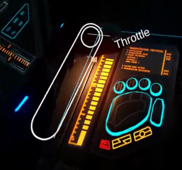
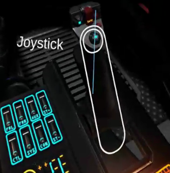
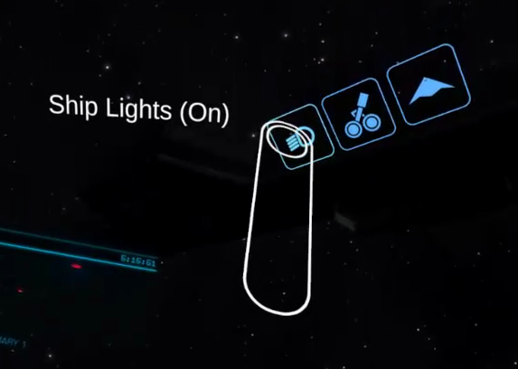

Elite VR Cockpit (Alpha)
================

**Elite VR Cockpit** is a SteamVR overlay for Elite Dangerous. The overlay is currently in an early alpha stage but contains a fair bit of basic functionality.

*Note: The early alpha has only been tested on the Vive with the Vive wands. Normally other HMDs work fine without any extra work. However the virtual HAT/POV switch on the joystick is designed around the Vive's trackpad and code to implement the equivalent on controllers with joysticks (Oculus Touch) or Joystick + small trackpad/trackbutton pairs (Windows Mixed Reality and Knuckles) has not been implemented yet.*

* [Download](https://github.com/dantman/elite-vr-cockpit/releases)
* [Getting Started](GETTING-STARTED.md)
* [Report a bug](https://github.com/dantman/elite-vr-cockpit/issues)

  

## Features

### Seated position reset

Hold down the application menu button on **both** of the Vive wands for a few seconds. This will reset your seated position to your current HMD location. Without needing to grab your keyboard or open the SteamVR dashboard settings.

### Virtual throttle and joystick

A virtual throttle and virtual joystick are located in the location of the in-game's throttle and joystick.

- The controls can be grabbed with the grip button to interact with them. *(Grab toggle planned for later)*
- The joystick is VTOL VR inspired. Only rotation of the controller is tracked. So you can grab the joystick then move your hand and rest the base of your controller on your leg to get a stable base to move around the joystick. No need to float your hand in mid-air.
- When edit mode is unlocked you can grab with the grip button and reposition the throttle and joystick.
- The trigger and application menu button are bound to different joystick buttons depending on whether they are grabbing the joystick or throttle.
- There are separate throttle/joystick positions for ships and for SRVs due to the different cockpit layouts.
  - The overlay automatically switches layouts when you deploy/dock your SRV.

#### HAT/POV switch

When grabbing the joystick the touchpad is bound to 2 separate joystick HAT/POV switches and a button.

- Pressing the trackpad in the center of the trackpad will output a virtual joystick BTN4 button press.
- Pressing the edges of the trackpad will output directional presses of the POV1 HAT switch.
- Dragging your finger along the trackpad will output directional presses of the POV2 HAT switch at regular intervals.

For example you could bind BTN4 to UI select. The POV2 direction to UI navigation directions like an omidirectional scroll wheel. And POV1 left/right to next/previous category. Which would allow you to slide your finger on the trackpad to navigate through holo panel options, press the edges of the trackpad to switch panel categories, and press the middle to select.

### Holographic buttons

The overlay provides a variety of ship functions as holographic buttons.

* *(Some button icons have not been gathered yet)*
* Buttons can be activated by pulling the trigger while interacting with them.
* When edit mode is unlocked, buttons can be grabbed by holding down the grip button (the edit mode button itself included) and repositioned wherever you like. *(positions will be saved when edit mode is re-locked)*
* Ship function buttons are not hardcoded to specific key/button bindings.
  * Your custom bindings will be read and the button will output whatever keypress that function is bound to. So you do not need specific bindings to use the overlay.
  * However all ship functions you wish to use must have *a* keyboard binding to work. Buttons for ship functions that you have not bound to a keyboard key yet will appear red.
  * Some ship functions have a "default" key they will output when no keyboard key is bound. This will allow you to easily bind controls without pulling out a keyboard by selecting an option in the controls menu and pressing a red ship function button to output the default key binding.
  * *(Some keyboard keys currently do not have mappings)*
* Most toggle functions have tooltips that will automatically change when ship status changes. (e.g. The landing gear button will switch between "Deploy landing gear" and "Retract landing gear" depending on whether the gear is up or down)
* New ship function buttons can be spawned from a button panel and deleted by moving them onto a trashbin icon if you do not need them.

### Elite Dangerous integration

The overlay is integrated with the status API provided by the game.

- Overlay items will not appear until the game begins to run.
- Cockpit controls will disappear when switching to the map screens.
- Some buttons for functions only available in the main ship will disappear when switching to a figher or SRV.
- Virtual joystick and throttle will change position when you switch to the SRV.
- Ship function holobuttons automatically use any keyboard bindings your ED custom bindings so you don't need specific configuration for them.
- You will be warned when ED not focused and will not receive input from the virtual joystick, throttle, or holographic buttons.

## License

The original code and assets in this project are "Copyright © Daniel Friesen - 2018" and are released under the GNU LGPL license version 3.0 or later.

This project uses resources from various other sources that have separate licenses.

`Assets/SteamVR`, `Assets/SteamVR_Input`, and `Assets/OpenVR` contain [SteamVR_Unity_Plugin](https://github.com/ValveSoftware/steamvr_unity_plugin) and [OpenVR](https://github.com/ValveSoftware/openvr) code provided by Valve Inc. under the [3-Clause BSD](https://github.com/ValveSoftware/steamvr_unity_plugin/blob/master/LICENSE) license.

`Assets/TextMesh Pro` contains assets from the TextMesh Pro asset built into Unity. A free license to this is provided to users of the Unity Personal Edition and above.

`Assets/vJoy` contains compiled binaries from the [vJoy](http://vjoystick.sourceforge.net/site/) SDK project provided under the [MIT license](https://github.com/shauleiz/vJoy/blob/master/LICENSE.txt).

`Assets/WindowsInput` contains code from the [InputSimulatorPlus](https://github.com/TChatzigiannakis/InputSimulatorPlus) library provided under the [Ms-Pl](https://github.com/TChatzigiannakis/InputSimulatorPlus/blob/master/LICENSE.md) license.

`Assets/Textures/Icons` contains icons from a variety of 3rd party sources. The [README](Assets/Textures/Icons/README.md) in that folder contains an author/source/license list for 3rd party icons used in the project.
